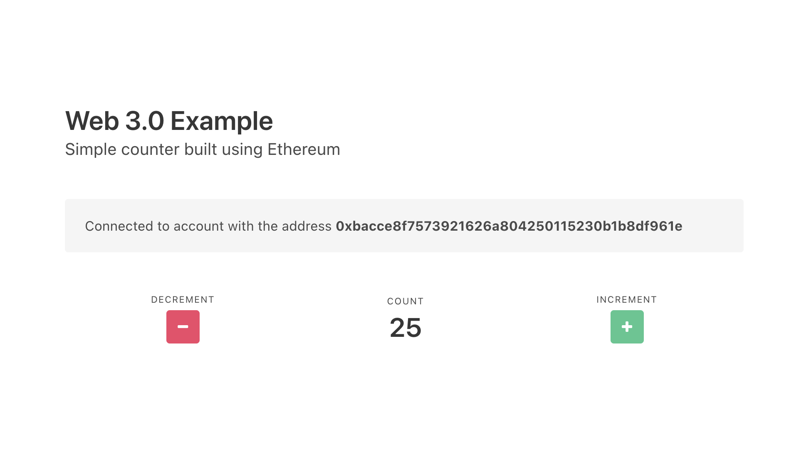
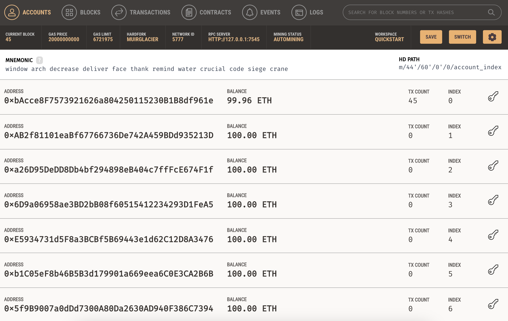
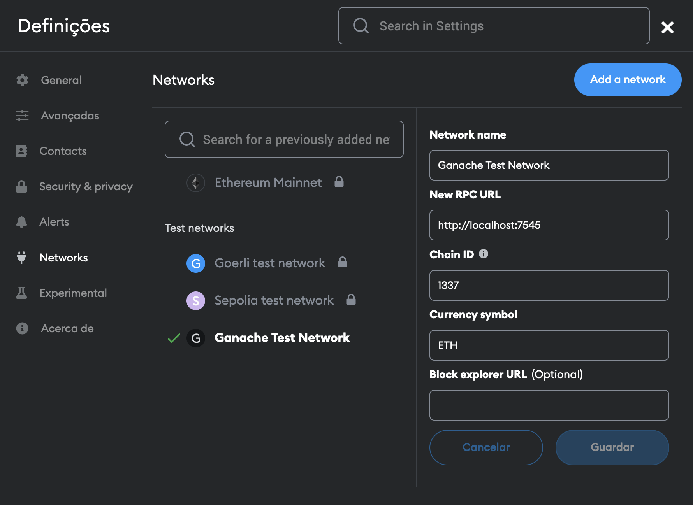
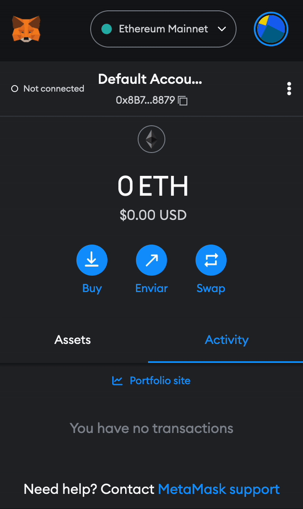
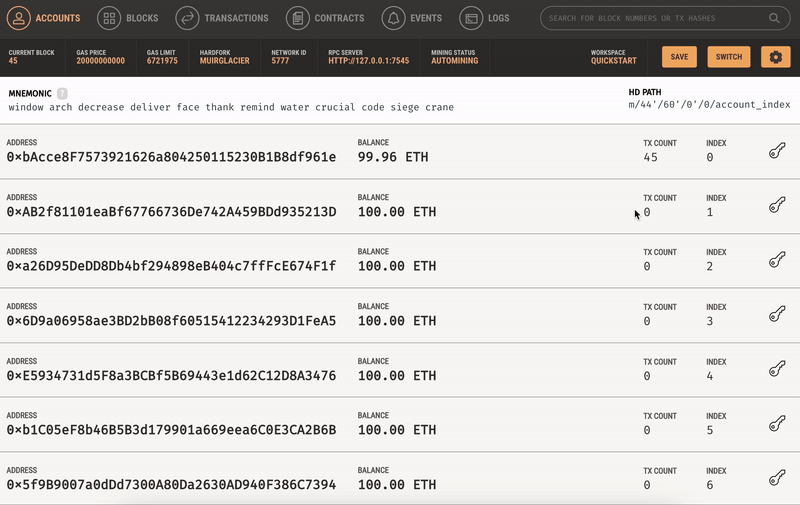
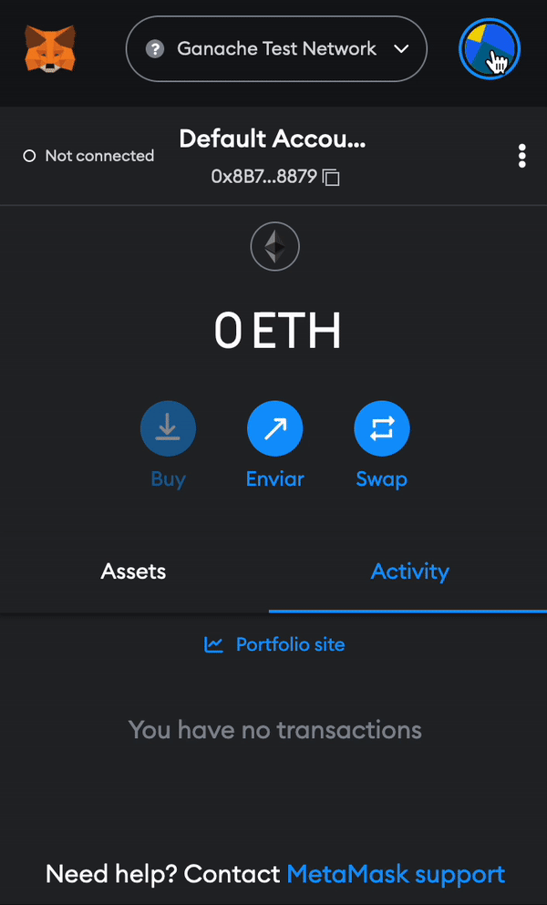
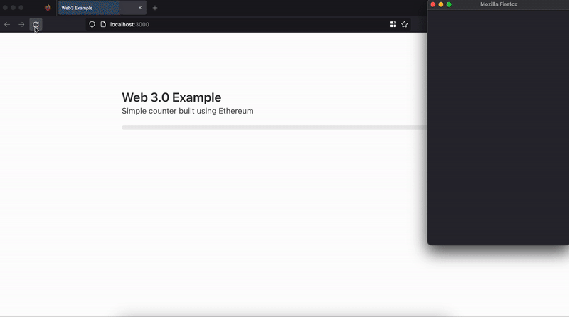

# Web 3.0 counter

This is a very simple counter application created in Ethereum, using [Truffle](https://trufflesuite.com/docs/truffle/) and [MetaMask](https://metamask.io/), to demonstrate how simple it is to create decentralized applications in the blockchain.

> **Note**
>
> This example was created with the help of [this tutorial](https://www.youtube.com/watch?v=rzvk2kdjr2I). Although the parts related to the interaction with MetaMask are outdated — _that part is now way more simple!_ — you can still check it to get an idea of how everything fits together.
> 
> You can find the most updated information on how to connect to your blockchain app using MetaMask [here](https://docs.metamask.io/guide/).

 

## Setup
### Step 1 - Install Ganache

[Ganache](https://trufflesuite.com/ganache/) is a local development blockchain used to develop decentralized applications (DApps) on the Ethereum blockchain. It simulates the Ethereum network, and lets you check how your DApp will perform before you release it to production.

Once you install it, open it and click on _Quickstart Ethereum_. It should look something like this: 

As you can see, it provides you with some test accounts that already have Ether in them so you can deploy your smart contract and test your DApp.

### Step 2 - Install MetaMask

[MetaMask](https://metamask.io/) is a cryptocurrency wallet that enables users to store Ether and other ERC-20 tokens. It can also be used to interact with DApps — _by injecting some Web 3.0 magic in your browser, it makes the job of creating front-end apps that interact with smart contracts super simple!_

It is available as a browser extension for multiple browsers so just install it on your preferred browser and follow the setup instructions.

### Step 3 - Connect to test network

Now that we have MetaMask working in our browser is time to connect it to the test network that we have running in Ganache.

Go to Settings > Networks and create your new test network with the same address used by Ganache.

Make sure that you are connected to your test network.

  

Now that we are connected to our test network it's time to import one of our test accounts so we can interact with DApps in our test network.

To do that we first need to copy the private key of one of our test account. Let's use the first one and copy the private key.

  

Then just import the account into MetaMask. Your should be able to see the Ether balance of your test account.

  

The hard part is done. Now let's run our DApp!

### Step 4 - Run the DApp

First, let's install all of our dependencies by running the good old `npm install`.

After that, it's time to deploy our smart contract to our test network using truffle with `truffle migrate`.

> **Note**
>
> During your development process you can also use the following commands:
> - `truffle compile` - to compile your smart contract and check for any errors before deploying
> - `truffle migrate --reset` - to redeploy your smart contract if you've made any changes after deploying the first time
> - `truffle console` - to interacted with the deployed smart contract directly in the console

Finally, we just need to run our front-end application with `npm run dev`, _et voilà!_ 

If everything is working as expected you should have something like this:

  

